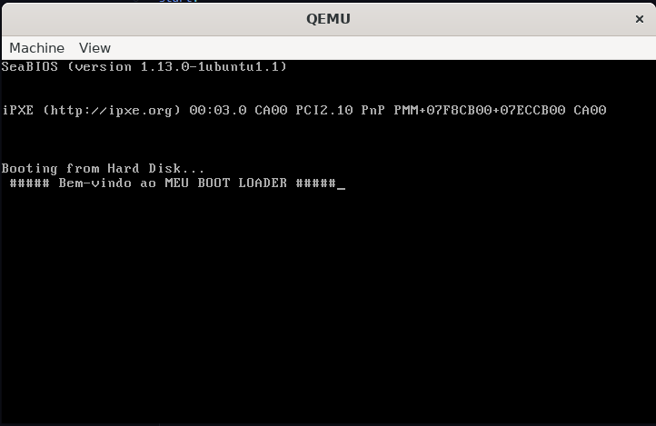
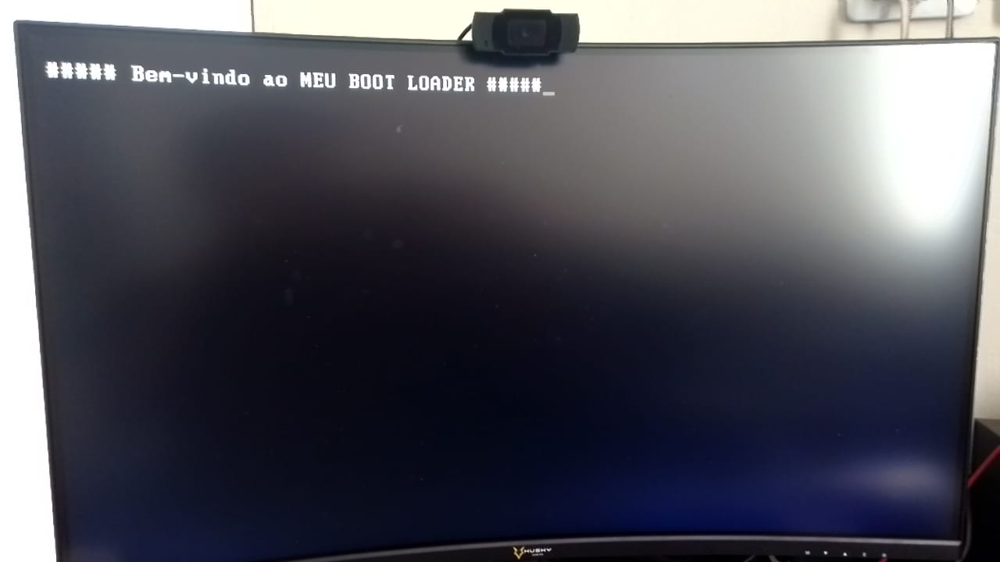

# Meu Primeiro Sistema Operacional do Zero

## O bootloader
* Para compilar, use o nasm

 `nasm -f bin boot.asm -o boot.bin`
* Para executar, use o Qemu

`qemu-system-x86_64 -hda ./boot.bin `

Rodando no Qemu

Rodando no PC Real Ryzen 5

